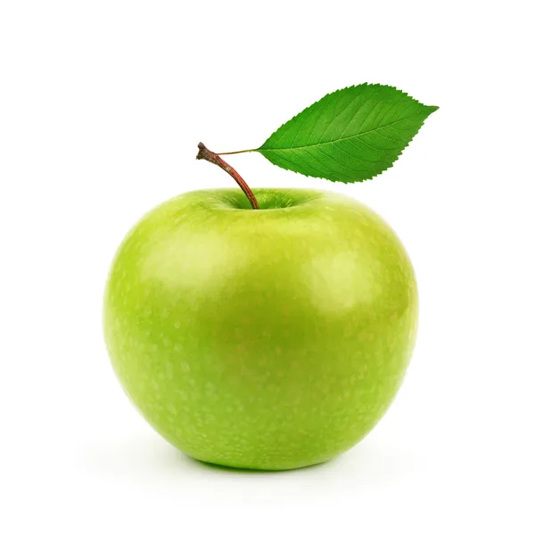
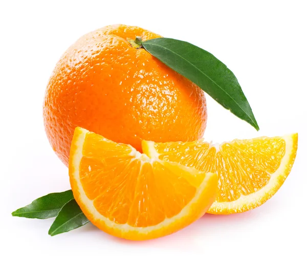

# Инструкция по языку Markdown

## Стилизация текста

Обычный текст

**Полужирный текст**

*Текст курсивом*
## Citation in Markdown
> Первый уровень
>> Второй уровень

## Списки
### Ненумерованный список
* Первый список
* Второй список

### Нумерованный список
1. Первый пункт
2. Второй пункт

## Картинки
Это яблоко

Это апельсин

